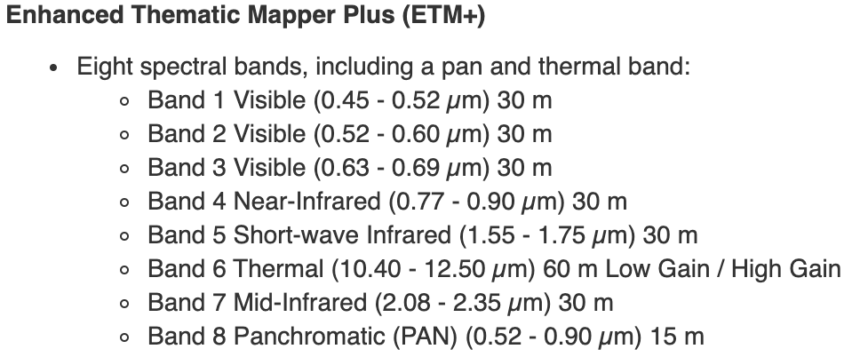

```{r setup, include=FALSE}
knitr::opts_chunk$set(echo = TRUE)

library(raster)
library(tidyverse)
library(here)
library(sf)
library(fasterize)
```

# The Data

```{r}

```

## Load and inspect the data

```{r}
landsat_file <- here('data/Landsat7.tif')

ls_1 <- raster(landsat_file)
ls_1
```
```{r}
plot(ls_1)
```

```{r}
ls_2 <- raster(landsat_file, band = 2)
ls_3 <- raster(landsat_file, band = 3)
ls_4 <- raster(landsat_file, band = 4)

ls_stack <- raster::stack(landsat_file)
ls_stack
```
## Preparing the data

```{r}
ls_1 <- raster::aggregate(ls_1, fact = 3, fun = mean)
ls_2 <- raster::aggregate(ls_2, fact = 3, fun = mean)
ls_3 <- raster::aggregate(ls_3, fact = 3, fun = mean)
ls_4 <- raster::aggregate(ls_4, fact = 3, fun = mean)
ls_4

plot(ls_1, col = hcl.colors(n=100, palette = 'Blues 2'))
plot(ls_2, col = hcl.colors(n=100, palette = 'Greens 2'))
plot(ls_3, col = hcl.colors(n=100, palette = 'Reds 2'))
plot(ls_4, col = hcl.colors(n=100, palette = 'Reds 2'))
```

```{r}
sbc_rast <- raster(here('data/county.tif'))
plot(sbc_rast)
plot(ls_3)
mask(ls_3, sbc_rast) %>% plot()
```


